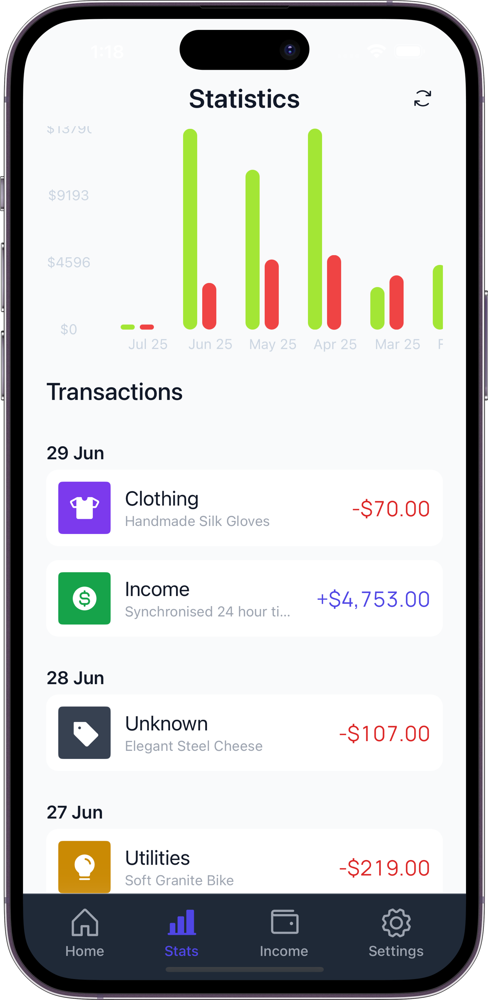
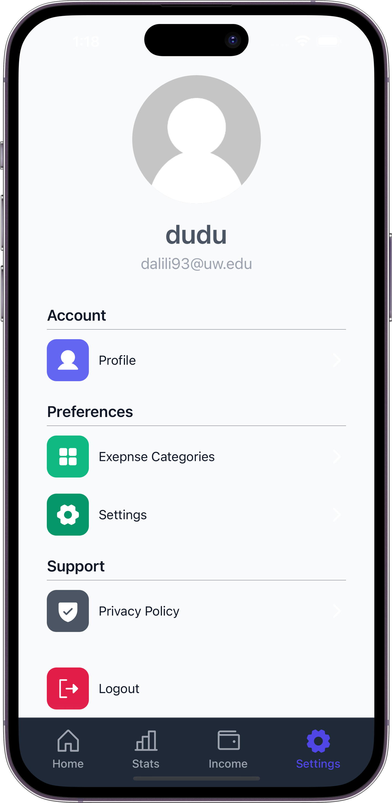

# Expense Tracker App

A mobile application built with React Native and Expo for tracking expenses and managing personal finances.

## Features

- **User Authentication**: Secure user login and registration.
- **Expense Tracking**: Easily add, categorize, and manage your daily expenses.
- **Wallet Management**: Create and manage multiple wallets for different accounts.
- **Statistics & Analytics**: Visualize your spending habits with charts and summaries.
- **Search & Filter**: Quickly find transactions with powerful search and filtering options.
- **User Profile**: Manage your profile information and settings.

## App Screenshots






## Technologies Used

- **React Native**: For building native mobile applications.
- **Expo**: A framework and platform for universal React applications.
- **Firebase**: Backend services for authentication, database (Firestore), and storage.
- **React Navigation**: For handling navigation within the app.
- **Formik & Yup**: For form management and validation.
- **Recharts**: For data visualization (charts).

## Getting Started

Follow these steps to set up and run the project locally:

### Prerequisites

- Node.js (LTS version recommended)
- npm or Yarn
- Expo CLI (`npm install -g expo-cli`)
- A Firebase project set up with Authentication (Email/Password), Firestore, and Storage enabled.

### Installation

1.  **Clone the repository:**
    ```bash
    git clone https://github.com/your-username/expense-tracker-app.git
    cd expense-tracker-app
    ```

2.  **Install dependencies:**
    ```bash
    npm install
    # or
    yarn install
    ```

3.  **Configure Firebase:**
    Create a `config/firebase.ts` file and add your Firebase configuration. You can get this from your Firebase project settings.

    ```typescript
    // config/firebase.ts
    import { initializeApp } from 'firebase/app';
    import { getAuth } from 'firebase/auth';
    import { getFirestore } from 'firebase/firestore';
    import { getStorage } from 'firebase/storage';

    const firebaseConfig = {
      apiKey: "YOUR_API_KEY",
      authDomain: "YOUR_AUTH_DOMAIN",
      projectId: "YOUR_PROJECT_ID",
      storageBucket: "YOUR_STORAGE_BUCKET",
      messagingSenderId: "YOUR_MESSAGING_SENDER_ID",
      appId: "YOUR_APP_ID"
    };

    // Initialize Firebase
    const app = initializeApp(firebaseConfig);
    const auth = getAuth(app);
    const db = getFirestore(app);
    const storage = getStorage(app);

    export { app, auth, db, storage };
    ```

### Running the App

1.  **Start the Expo development server:**
    ```bash
    npx expo start
    ```

2.  **Open the app:**
    -   Scan the QR code with the Expo Go app on your physical device (iOS or Android).
    -   Press `a` to open on Android emulator.
    -   Press `i` to open on iOS simulator.
    -   Press `w` to open in web browser (limited functionality).

## Project Structure

```
.
├── app/                  # Main application screens and navigation
│   ├── (auth)/           # Authentication related screens (Login, Signup, Welcome)
│   ├── (modals)/         # Modal components (Category, Icon Picker, Profile, etc.)
│   └── (tabs)/           # Tab-based navigation screens (Home, Settings, Statistics, Wallet)
├── assets/               # Static assets like fonts and images
├── components/           # Reusable UI components
├── config/               # Firebase configuration
├── constants/            # App-wide constants (data, icons, theme)
├── contexts/             # React Contexts for global state (Auth, Theme)
├── hooks/                # Custom React hooks
├── schemas/              # Validation schemas (e.g., for forms)
├── services/             # API service calls (Firebase interactions)
├── store/                # Zustand store for analytics (example)
└── utils/                # Utility functions (auth, common helpers, styling)
```

## Contributing

Contributions are welcome! Please feel free to open issues or submit pull requests.

## License

This project is licensed under the MIT License.